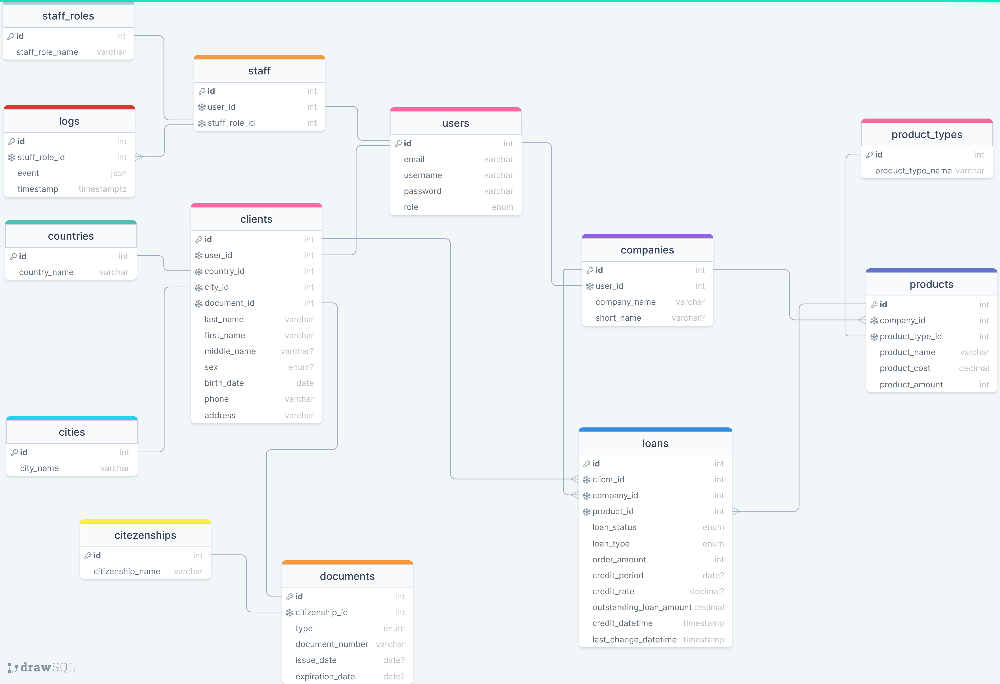

# Система кредитования клиентов

---

### Борисёнок Елизавета Андреевна 054504

---

### Функциональные требования к проекту

За основу взята база данных PostgreSQL

Проект предполагает собой сервис по кредитованию клиентов. Основная фукнциональность состоит в том, что компании размещают свои продукты (товары) в кредит/рассрочку клиентам.
В свою очередь клиенты оформляют займы на кредит/рассрочку этих продуктов(товаров).

Существует 3 основные роли:
1. **Staff** - позволяет администрировать платформу, просматривать логи действий пользователей. 
Стандартный *CRUD* для основных данных таблиц. В свою очередь **staff** имеет свои подроли (staff_roles) для разного уровня администрировании сервиса например: *admin*, *moderator*, *helper*.
2. **Company** - роль компании, представляет собой профиль для размещения продуктов (товаров)
3. **Client** - роль клиента, позволяет оформлять займы на продукты (товары)

Возможность платформы:
1. Предоставить регистрацию, авторизацию пользователей согласно их ролей
2. Реализовать CRUD на основании ролей

---

### Список сущностей БД

1. Users - пользователи
2. Staff - сотрудники платформы
3. Staff_roles - роли сотрудников платформы
4. Logs - логи действий пользователей сервиса
5. Clients - клиенты
6. Countries - страны проживания клиентов
7. Cities - города проживания клиентов
8. Documents - ДУЛ клиента
9. Citizenships - гражданства клиентов
10. Companies - компании
11. Products - продукты компании
12. Products_type - тип продукта
13. Loans - займы

--- 

### Типы связей в БД

Связь Many-to-Many достигается с помощью таблицы Loans (займы) и связывает таблицы Clients (клиенты) и Products (продукты)

---

### Схема БД

---

### Описание сущностей

Размер данных основывается на степени 2.

1. Users (пользователи)

| Имя поля |  Тип                          | Описание          | Ограничения                                |
|----------|-------------------------------|-------------------|--------------------------------------------|
| id       | INT(16)                       | PK                | Required, unique, auto-increment, not null |
| email    | VARCHAR(32)                   | Электронная почта | Required, unique, not null                 |
| username | VARCHAR(16)                   | Никнейм           | Required, unique, not null                 |
| password | VARCHAR(32)                   | Пароль (хеш)      | Required,  unique, not null                |
| role     | ENUM (staff, client, company) | Роль пользователя | Required, not null                         |

Примечание: role - не отдельная таблица так как на количестве ролей завязана логика и связи в бд, в отличии от staff_roles

2. Staff (персонал)

| Имя поля      | Тип       | Описание            | Ограничения                                |
|---------------|-----------|---------------------|--------------------------------------------|
| id            | INT(16)   | PK                  | Required, unique, auto-increment, not null | 
| user_id       | INT(16)   | FK to "Users"       | Required, unique, not null                 |
| staff_role_id | INT(16)   | FK to "Staff Roles" | Required, not null                         |

3. Staff_roles (роли персонала)

| Имя поля         | Тип         | Описание       | Ограничения                                |
|------------------|-------------|----------------|--------------------------------------------|
| id               | INT(16)     | PK             | Required, unique, auto-increment, not null | 
| staff_role_name  | VARCHAR(16) | Роль персонала | Required, not null                         |

4. Logs (логи)

| Имя поля      | Тип         | Описание                 | Ограничения                                |
|---------------|-------------|--------------------------|--------------------------------------------|
| id            | INT(16)     | PK                       | Required, unique, auto-increment, not null | 
| staff_role_id | INT(16)     | FK to "Staff"            | Required, not null                         |
| event         | JSON        | Событие в формате json   | Required, not null                         |
| timestamp     | TIMESTAMPTZ | Время лога               | Required, not null                         |

5. Clients (клиенты)

| Имя поля     | Тип                | Описание             | Ограничения                                |
|--------------|--------------------|----------------------|--------------------------------------------|
| id           | INT(16)            | PK                   | Required, unique, auto-increment, not null |
| user_id      | INT(16)            | FK to "Users"        | Required, unique, not null                 |
| country_id   | INT(16)            | FK to "Countries"    | Required, not null                         |   
| city_id      | INT(16)            | FK to "Cities"       | Required, not null                         | 
| document_id  | INT(16)            | FK to "Documents"    | Required, unique, not null                 |
| last_name    | VARCHAR(32)        | Фамилия              | Required, not null                         |
| first_name   | VARCHAR(32)        | Имя                  | Required, not null                         |
| middle_name  | VARCHAR(32)        | Отчество             | Optional                                   |
| sex          | ENUM(Male, Female) | Пол                  | Optional                                   |
| birth_date   | DATE               | Дата рождения        | Required, not null                         |
| phone        | VARCHAR(16)        | Номер телефона       | Required, not null                         | 
| address      | VARCHAR(64)        | Адрессная информация | Required, not null                         | 

6. Countries (страны)

| Имя поля     | Тип         | Описание        | Ограничения                                  |
|--------------|-------------|-----------------|----------------------------------------------|
| id           | INT(16)     | PK              | Required, unique, auto-increment, not null   | 
| country_name | VARCHAR(32) | Название страны | Required, not null                           | 

7. Cities (города)
 
| Имя поля  | Тип         | Описание        | Ограничения                                  |
|-----------|-------------|-----------------|----------------------------------------------|
| id        | INT(16)     | PK              | Required, unique, auto-increment, not null   | 
| city_name | VARCHAR(32) | Название города | Required, not null                           |

8. Documents (документы)

| Имя поля         | Тип                               | Описание                      | Ограничения                                |
|------------------|-----------------------------------|-------------------------------|--------------------------------------------|
| id               | INT(16)                           | PK                            | Required, unique, auto-increment, not null | 
| citizenship_id   | INT(16)                           | FK to "Citizenships"          | Required, not null                         |
| type             | ENUM(passport, residence, permit) | Тип документа                 | Required, not null                         |
| documents_number | VARCHAR(32)                       | Document number               | Required, not null                         |
| issue_date       | DATE                              | Дата выдачи                   | Optional                                   |
| expiration_date  | DATE                              | Дата истечения срока действия | Optional                                   |

9. Citizenships (гражданства)

| Имя поля           | Тип        | Описание    | Ограничения                                |
|--------------------|------------|-------------|--------------------------------------------|
| id                 | INT(16)    | PK          | Required, unique, auto-increment, not null | 
| citizenship_name   | VARCHAR(4) | Гражданство | Required, not null                         |

Примечание: небольшой размер citizenship_name достигается путем того, что в международной системе гражданства используют короткие аббревиатуры, например: BLR, KGZ

10. Companies (компании)

| Имя поля     | Тип         | Описание               | Ограничения                                |
|--------------|-------------|------------------------|--------------------------------------------|
| id           | INT(16)     | PK                     | Required, unique, auto-increment, not null |
| user_id      | INT(16)     | FK to "Users"          | Required, unique                           |
| company_name | VARCHAR(32) | Название компании      | Required, not null                         |
| short_name   | VARCHAR(32) | Аббревиатура  компании | Optional                                   |

11. Products (продукты)

| Имя поля       | Тип         | Описание                        | Ограничения                                |
|----------------|-------------|---------------------------------|--------------------------------------------|
| id             | INT(16)     | PK                              | Required, unique, auto-increment, not null |          
| company_id     | INT(16)     | FK to "Companies"               | Required                                   |
| product_type   | ENUM        | Тип продукта                    | Required, not null                         |
| product_name   | VARCHAR(32) | Название продукта               | Required, not null                         |
| product_cost   | DECIMAL(16) | Стоимость продукта (в копейках) | Required, not null                         |
| product_amount | INT(16)     | Количество продукта             | Required, not null                         |

12. Product_types (типы продуктов)

| Имя поля          | Тип         | Описание     | Ограничения                                  |
|-------------------|-------------|--------------|----------------------------------------------|
| id                | INT(16)     | PK           | Required, unique, auto-increment, not null   | 
| Product_type_name | VARCHAR(32) | Тип продукта | Required, not null                           | 

13. Loans (займы)

| Имя поля                | Тип                                                   | Описание                         | Ограничения                                |
|-------------------------|-------------------------------------------------------|----------------------------------|--------------------------------------------|
| id                      | INT(16)                                               | PK                               | Required, unique, auto-increment, not null | 
| client_id               | INT(16)                                               | FK to "Clients"                  | Required, not null                         |
| company_id              | INT(16)                                               | FK to "Companies"                | Required, not null                         |
| product_id              | INT(16)                                               | FK to "Products"                 | Required, not null                         |
| loan_status             | ENUM(created, confirmed, issued, redeemed, overdue)   | Статус займа                     | Required, not null                         |
| loan_type               | ENUM(installment, credit)                             | Тип займа                        | Required, not null                         |
| order_amount            | INT(16)                                               | Количество продуктов в займе     | Required, not null                         |
| credit_period           | DATE                                                  | Время кредитования               | Optional                                   |
| credit_rate             | DECIMAL(16)                                           | Процентная ставка                | Optional                                   |
| outstanding_loan_amount | DECIMAL(16)                                           | Общая сумма займа (в копейках)   | Required, not null                         |
| credit_datetime         | TIMESTAMP                                             | Время открытия займа             | Required, not null                         |
| last_change_datetime    | TIMESTAMP                                             | Время последнего изменения займа | Required, not null                         |
